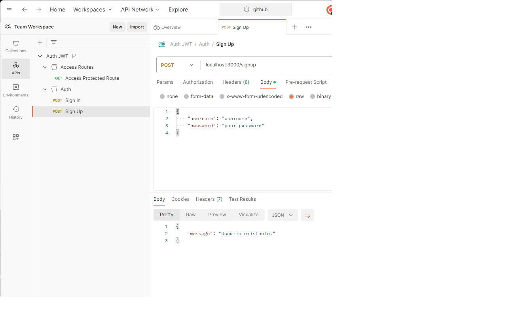

<h1 align="center">API REST com Autenticação</h1>

<div align="center">

[Projeto](#projeto)
&nbsp;&nbsp;&nbsp;|&nbsp;&nbsp;&nbsp;
[Instalação](#instalacao)
&nbsp;&nbsp;&nbsp;|&nbsp;&nbsp;&nbsp;
[Uso](#uso)
&nbsp;&nbsp;&nbsp;|&nbsp;&nbsp;&nbsp;
[Tecnologias](#tecnologias)
&nbsp;&nbsp;&nbsp;|&nbsp;&nbsp;&nbsp;
[Licença](#license)

</div>

<p align="center">
  
</p>

<br>

<div align="center">



</div>

<hr>
<br>
<br>

## 💻 Projeto <a name = "projeto"></a>

Esse projeto foi desenvolvido durante uma atividade de Integração de Aplicações, e ela se encontra no [Exercicios Prático 02.pdf](assets/pdf/Exercicios%20Prático%2002.pdf).

Consiste em desenvolver uma API REST utilizando os métodos HTTP, com criação e login de usuários e autenticá-los. A linguagem e frameworks poderiam ser utilizados a nossa escolha. Sendo assim, utilizei o Node, TypeScript, Express e o Postman.

Para criar e armazenar os dados, não utilizei nada fora Arrays e JSON.

<br>
<br>

## ⚙️ Instalação <a name = "instalacao"></a>

Instale as dependências do projeto:

```
npm install
```

E vincule as requisições ao postman.

<br>
<br>

## 👨‍💻 Uso <a name = "uso"></a>

Primeiro, precisa inicializar o servidor:

```
npm run dev
```

E pronto, já pode utilizar o Postman para fazer as requisições.

<br>
<br>

## 🚀 Tecnologias <a name = "tecnologias"></a>

- Node
- TypeScript
- Express
- Bcrypt
- Postman

<br>
<br>

## 🔒 Licença

Esse projeto está sob a licença MIT.

<hr>
